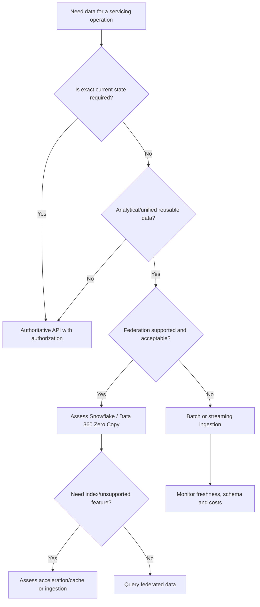

# Choosing data access

```mermaid
flowchart TD
 Q[Need data for a servicing operation] --> A{Is exact current state required?}
 A -->|Yes| B[Authoritative API with authorization]
 A -->|No| C{Analytical/unified reusable data?}
 C -->|No| B
 C -->|Yes| D{Federation supported and acceptable?}
 D -->|Yes| E[Assess Snowflake / Data 360 Zero Copy]
 D -->|No| F[Batch or streaming ingestion]
 E --> G{Need index/unsupported feature?}
 G -->|Yes| H[Assess acceleration/cache or ingestion]
 G -->|No| I[Query federated data]
 F --> J[Monitor freshness, schema and costs]
```

Zero Copy is read-only federation and has feature-specific restrictions; streaming ingestion is asynchronous, not a guarantee of immediate consistency. See `REFERENCES.md`.
