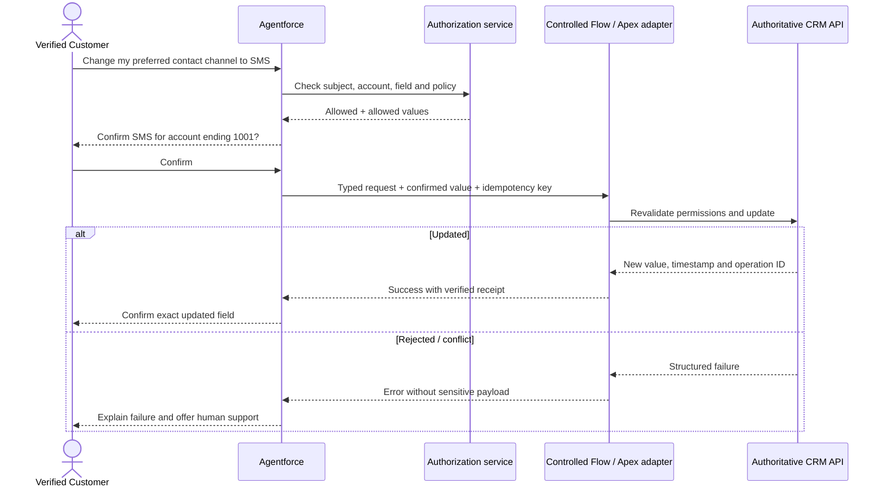

# Controlled profile update sequence

```mermaid
sequenceDiagram
  actor C as Verified Customer
  participant A as Agentforce
  participant AZ as Authorization service
  participant F as Controlled Flow / Apex adapter
  participant CRM as Authoritative CRM API
  C->>A: Change my preferred contact channel to SMS
  A->>AZ: Check subject, account, field and policy
  AZ-->>A: Allowed + allowed values
  A-->>C: Confirm SMS for account ending 1001?
  C->>A: Confirm
  A->>F: Typed request + confirmed value + idempotency key
  F->>CRM: Revalidate permissions and update
  alt Updated
    CRM-->>F: New value, timestamp and operation ID
    F-->>A: Success with verified receipt
    A-->>C: Confirm exact updated field
  else Rejected / conflict
    CRM-->>F: Structured failure
    F-->>A: Error without sensitive payload
    A-->>C: Explain failure and offer human support
  end
```

**Invariant:** do not make a success claim until the system-of-record response confirms the write. A model-generated instruction is never proof of execution.
