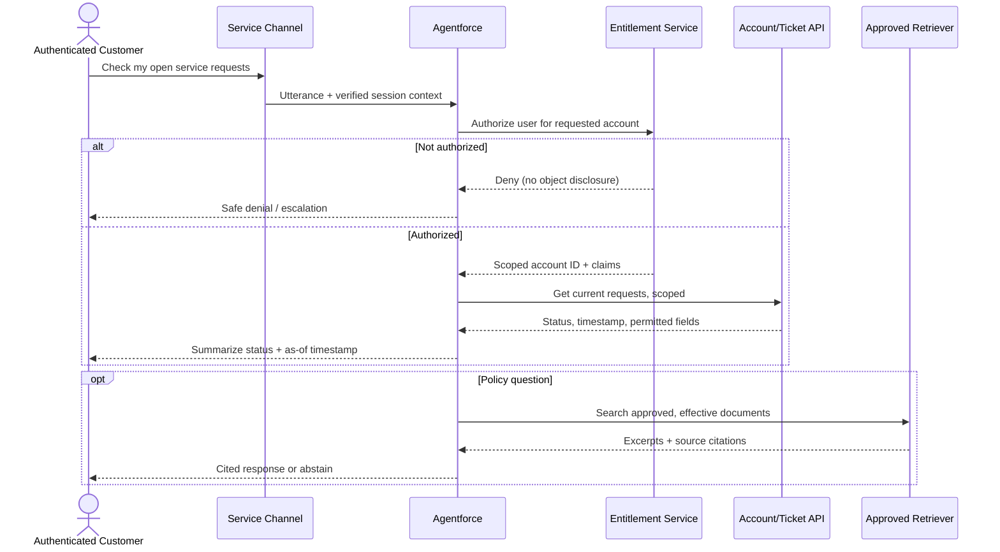

# Servicing request sequence

```mermaid
sequenceDiagram
  actor C as Authenticated Customer
  participant UI as Service Channel
  participant A as Agentforce
  participant AZ as Entitlement Service
  participant API as Account/Ticket API
  participant KB as Approved Retriever
  C->>UI: Check my open service requests
  UI->>A: Utterance + verified session context
  A->>AZ: Authorize user for requested account
  alt Not authorized
    AZ-->>A: Deny (no object disclosure)
    A-->>C: Safe denial / escalation
  else Authorized
    AZ-->>A: Scoped account ID + claims
    A->>API: Get current requests, scoped
    API-->>A: Status, timestamp, permitted fields
    A-->>C: Summarize status + as-of timestamp
  end
  opt Policy question
    A->>KB: Search approved, effective documents
    KB-->>A: Excerpts + source citations
    A-->>C: Cited response or abstain
  end
```

**Design note:** cross-system identity must not rely on an unverified email supplied by the caller. Use authenticated subject and server-side account relationships.
